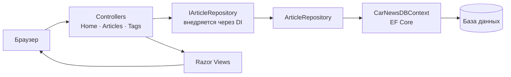

# Car News — новостной портал на ASP.NET Core MVC

  

Веб-приложение для публикации и чтения статей об автомобилях: главная с каруселью,
каталог статей, страница отдельной статьи, форма добавления. Учебный проект 2023 года.

**Стек:** C# · ASP.NET Core MVC 6 · Entity Framework Core · Razor · Bootstrap

## Как устроено

Классическое MVC-разделение с внедрением зависимостей:

```text
Controllers/     Home, Articles, Tags — маршруты и подготовка моделей
Views/           Razor-страницы: Index, Articles, Article, AddArticle, Privacy
Models/          ViewModel для представлений
Entities/        Article, Tags — модель хранения
DTO/             ArticleDTO, TagDTO — контракт формы добавления
Repositories/    ArticleRepository за интерфейсом IArticleRepository
Context/         CarNewsDBContext — DbContext EF Core
wwwroot/         статика, изображения статей, JSON с исходным контентом
```

Доступ к данным идёт через `IArticleRepository`, зарегистрированный в DI
(`AddTransient<IArticleRepository, ArticleRepository>`) — контроллеры не знают о
конкретном хранилище. Схема создаётся на старте через `Database.EnsureCreated()`.

## Поток запроса



Контроллеры зависят от интерфейса `IArticleRepository`, а не от его реализации: конкретный
класс подставляется в `Program.cs` через `AddTransient`.

## Незавершённые части

В проекте есть заготовка более продвинутого слоя доступа к данным, которая **не
подключена** и в работе приложения не участвует — оставлена как есть:

- `Postgres.cs` — регистрация сущностей как композитных типов Postgres (`MapCompositeTypes`)
  и настройка FluentMigrator (`AddMigrations`). Ни один из двух методов ниоткуда не
  вызывается; классов миграций в проекте нет.
- Пакеты `Dapper`, `Npgsql`, `FluentMigrator`, `Microsoft.Data.Sqlite` подключены в
  `.csproj`, но рабочий путь использует только EF Core.
- В `CarNewsDBContext` и `Program.cs` остались закомментированные варианты на SQLite
  и seed-данные.

То есть в какой-то момент проект переезжал между хранилищами, и следы этого переезда
остались в коде.

## Запуск

Нужен .NET SDK 6.0 и доступная база; строка подключения задаётся в
`Context/CarNewsDBContext.cs`.

```bash
dotnet run --project WebApplication1
```

Приложение поднимется на порту из `Properties/launchSettings.json`, стартовая
страница — `Home/Index`.
